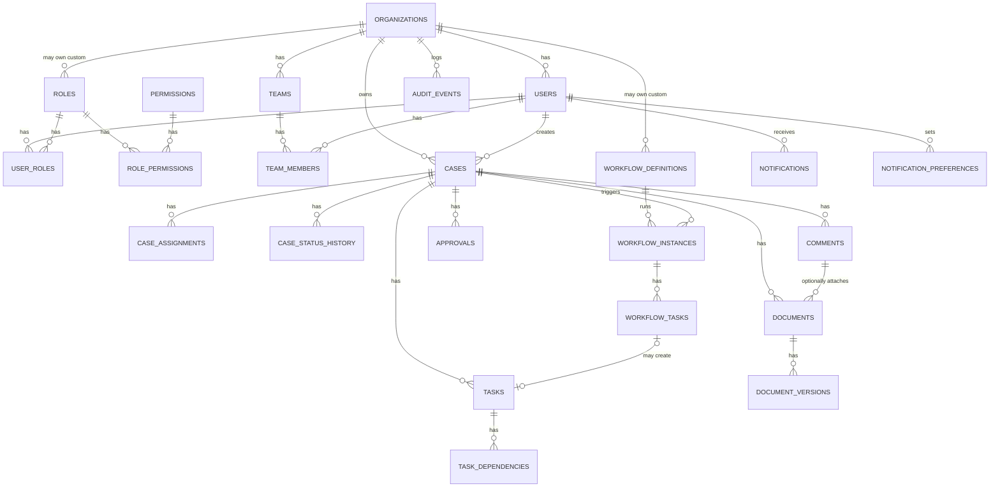

# Resolve — Consolidated Database Schema (Single Source of Truth)

**Source of truth:** `Resolve_SRS_Consolidated.md` (v1.0) and `Resolve_Feature_List_and_Phases_Consolidated.md`
**Primary engine:** PostgreSQL (system of record — NFR-REL-03)
**Supporting stores:** Redis (cache/coordination), Kafka (event transport), OpenSearch/Elasticsearch (search projection), S3-compatible object storage (binary files)
**Status:** Consolidated from four independently drafted schema proposals into one buildable reference. Every table below exists to make a specific FR/NFR/BR from the SRS implementable — nothing is included "for completeness" alone, and nothing an approved feature needs has been left out.

> **MongoDB is explicitly not part of this architecture.** PostgreSQL is the relational system of record; Redis, Kafka, OpenSearch/Elasticsearch, and S3-compatible storage each serve one distinct, narrow supporting role.

---

## 0. Merge Notes — How Conflicts Were Resolved

The four source drafts mostly agreed, but diverged on a few points. Resolutions below, so nobody has to re-litigate them mid-sprint:

| Conflict | Drafts disagreed on | Resolution | Why |
|---|---|---|---|
| Enum storage | Native Postgres `ENUM` vs. `VARCHAR` + `CHECK` | **`VARCHAR` + `CHECK`** everywhere | Native `ENUM` requires an `ALTER TYPE` (which takes a lock and can't run inside some transaction modes) just to add a value; `CHECK` constraints are just a migration. Given the project explicitly runs on versioned migrations (FR-QA-05), this is the lower-friction choice. |
| Team-membership join table name | `team_users` vs. `team_members` vs. "Team Membership" | **`team_members`** | Matches the project's existing join-table convention of naming by the *owning* entity first (`user_roles`, `role_permissions`), and reads more naturally in code (`team.members`). |
| `workflow_tasks` semantics | One draft modeled it as "a task spawned by a workflow, pointer to `tasks`"; another modeled it as "a logged, idempotent rule-action execution" | **Merged**: it's the rule-action execution log (action type, payload, idempotency key) *plus* an optional pointer back to the `tasks` row it created | The action-log shape is what actually satisfies BR-16 (idempotent rule execution) and FR-EVT-04; the pointer-back column preserves the traceability the other drafts wanted, without needing two tables. |
| `notification_preferences` grain | One row per user with two boolean columns, vs. one row per `(user, event_type, channel)` | **Per `(user_id, event_type, channel)`** | FR-NOT-03 asks for *per-user* preferences, but a single email/in-app toggle can't express "email me on approvals but not on mentions." The finer grain costs one extra table dimension and directly supports the requirement instead of approximating it. |
| Case-status-history column names | `from_status`/`to_status` vs. `previous_status`/`new_status` | **`from_status`/`to_status`** | 3 of 4 drafts already agreed on this; kept for consistency. |
| Optimistic locking scope | Some drafts implied `version` on multiple tables | **`version` only on `cases`** | FR-CASE-08 / NFR-CONC-01 name the case entity specifically as the concurrency-risk hotspot (simultaneous case updates by different actors). Other tables aren't currently required to carry it — add it later, table by table, only if a real contention problem shows up (per NFR-MAINT-02: don't add mechanism without a demonstrated need). |
| Outbox table scope | Some drafts omitted `organization_id`/`event_version` on `outbox_events` | **Both included** | `organization_id` lets the team filter/triage a stuck DLQ per tenant without a join; `event_version` is required for FR-EVT-06 (versioned, backward-compatible event schemas) to mean anything at the storage level. |

---

## 1. Conventions

- **Primary keys** are `UUID`, generated with `gen_random_uuid()` (or app-side UUIDv7) — safe to expose in URLs, safe across future horizontal partitioning.
- **Tenant-owned tables** always carry `organization_id UUID NOT NULL REFERENCES organizations(id)`, and every query against them filters by it (FR-TEN-01, FR-TEN-02). Tables without `organization_id` are either `organizations` itself or genuinely platform-global (e.g., `permissions`).
- **Timestamps** are `TIMESTAMPTZ`, defaulting to `now()`, always stored/compared in UTC (ISO-8601 at the API boundary, e.g. `2026-09-01T10:00:00Z`). Every table has `created_at`; mutable tables also have `updated_at`.
- **Optimistic locking**: `cases.version INTEGER NOT NULL DEFAULT 0`, incremented on every update; a write against a stale version is rejected with HTTP 409 (FR-CASE-08, FR-IDC-02).
- **Append-only tables** (`audit_events`, `case_status_history`, `outbox_events`) have no `updated_at` and no update/delete path at the application layer (FR-AUD-06, BR-13).
- **Enums** are `VARCHAR` + `CHECK` constraints, not native Postgres `ENUM` (see §0 rationale).
- **Soft delete**: `is_archived BOOLEAN` is used instead of physical deletion wherever the SRS requires history preservation (FR-CASE-14).
- **JSONB** is reserved for genuinely variable-shape data: audit before/after snapshots, workflow rule definitions, event payloads. It is not used as a substitute for normalized columns on frequently-queried fields.

### Entity Relationship Overview



---

## 2. Core Relational Schema (PostgreSQL)

### 2.1 Identity, Organizations & Access Control

#### `organizations`
Root tenant boundary — every other tenant-owned table hangs off this (FR-ORG-01).

| Column | Type | Constraints | Description |
|---|---|---|---|
| `id` | UUID | PK | Tenant identifier, referenced by every tenant-owned table. |
| `name` | VARCHAR(255) | NOT NULL | Display name of the organization. |
| `slug` | VARCHAR(100) | UNIQUE, NOT NULL | URL-safe identifier (e.g. for tenant-aware routing). Not SRS-mandated but near-zero cost and standard practice for a multi-tenant app. |
| `status` | VARCHAR(20) | NOT NULL, DEFAULT `'ACTIVE'`, CHECK IN (`ACTIVE`,`SUSPENDED`) | Platform-level lifecycle state, managed by System Administrators. |
| `created_at` | TIMESTAMPTZ | NOT NULL, DEFAULT now() | Provisioning timestamp. |
| `updated_at` | TIMESTAMPTZ | NOT NULL, DEFAULT now() | Last metadata change. |

#### `users`
Authenticatable identities, always scoped to exactly one organization (FR-IAM-01, FR-ORG-02, SRS §1.3).

| Column | Type | Constraints | Description |
|---|---|---|---|
| `id` | UUID | PK | User identifier. |
| `organization_id` | UUID | FK → `organizations.id`, NOT NULL | A user belongs to exactly one tenant. |
| `email` | VARCHAR(255) | NOT NULL | Login identifier. |
| `username` | VARCHAR(100) | NULL | Optional separate login handle, if the tenant prefers username over email login. |
| `password_hash` | VARCHAR(255) | NOT NULL | bcrypt/argon2 hash — plaintext is never stored (FR-IAM-05). |
| `full_name` | VARCHAR(255) | NULL | Display name. |
| `status` | VARCHAR(20) | NOT NULL, DEFAULT `'ACTIVE'`, CHECK IN (`ACTIVE`,`DISABLED`) | A `DISABLED` user fails authentication. |
| `created_at` | TIMESTAMPTZ | NOT NULL, DEFAULT now() | — |
| `updated_at` | TIMESTAMPTZ | NOT NULL, DEFAULT now() | — |
| *(unique)* | — | UNIQUE(`organization_id`, `email`) | Email is unique within a tenant, not globally. |

#### `teams`
Named groups a case or task can be assigned to collectively (FR-ORG-03).

| Column | Type | Constraints | Description |
|---|---|---|---|
| `id` | UUID | PK | — |
| `organization_id` | UUID | FK → `organizations.id`, NOT NULL | Owning tenant. |
| `name` | VARCHAR(255) | NOT NULL | Team display name. |
| `created_at` | TIMESTAMPTZ | NOT NULL, DEFAULT now() | — |
| `updated_at` | TIMESTAMPTZ | NOT NULL, DEFAULT now() | — |

#### `team_members`
Join table for team membership; drives permission inheritance (BR-15).

| Column | Type | Constraints | Description |
|---|---|---|---|
| `team_id` | UUID | FK → `teams.id`, PK (part 1) | — |
| `user_id` | UUID | FK → `users.id`, PK (part 2) | — |
| `joined_at` | TIMESTAMPTZ | NOT NULL, DEFAULT now() | — |

#### `roles`
Named collections of permissions; system-defined or tenant-custom (FR-AUZ-01, FR-AUZ-05).

| Column | Type | Constraints | Description |
|---|---|---|---|
| `id` | UUID | PK | — |
| `organization_id` | UUID | FK → `organizations.id`, NULL | `NULL` = platform-wide system role (e.g., `ORG_ADMIN`); non-null = tenant-scoped custom role. |
| `name` | VARCHAR(100) | NOT NULL | E.g. `SENIOR_MANAGER`. |
| `description` | TEXT | NULL | — |
| `is_system_role` | BOOLEAN | NOT NULL, DEFAULT `false` | System roles cannot be edited/deleted by tenant admins. |
| `created_at` | TIMESTAMPTZ | NOT NULL, DEFAULT now() | — |

#### `permissions`
Atomic, platform-global permission codes (FR-AUZ-01).

| Column | Type | Constraints | Description |
|---|---|---|---|
| `id` | UUID | PK | — |
| `code` | VARCHAR(100) | UNIQUE, NOT NULL | E.g. `CASE_READ`, `CASE_APPROVE`. |
| `description` | TEXT | NULL | — |

Suggested seed catalog (finalize the exact set with the team):
```text
CASE_READ, CASE_CREATE, CASE_UPDATE, CASE_ASSIGN, CASE_APPROVE
TASK_READ, TASK_CREATE, TASK_UPDATE
DOCUMENT_READ, DOCUMENT_UPLOAD
COMMENT_READ, COMMENT_CREATE
AUDIT_READ
USER_MANAGE, TEAM_MANAGE, ROLE_MANAGE
```

#### `user_roles`
Many-to-many Users ↔ Roles (FR-AUZ-04).

| Column | Type | Constraints | Description |
|---|---|---|---|
| `user_id` | UUID | FK → `users.id`, PK (part 1) | — |
| `role_id` | UUID | FK → `roles.id`, PK (part 2) | — |
| `assigned_at` | TIMESTAMPTZ | NOT NULL, DEFAULT now() | Grant timestamp — useful for audit. |

#### `role_permissions`
Many-to-many Roles ↔ Permissions (FR-AUZ-04).

| Column | Type | Constraints | Description |
|---|---|---|---|
| `role_id` | UUID | FK → `roles.id`, PK (part 1) | — |
| `permission_id` | UUID | FK → `permissions.id`, PK (part 2) | — |

---

### 2.2 Case Management

#### `cases`
The central business entity (FR-CASE-01…15).

| Column | Type | Constraints | Description |
|---|---|---|---|
| `id` | UUID | PK | — |
| `organization_id` | UUID | FK → `organizations.id`, NOT NULL | Every query filters on this (FR-TEN-02). |
| `case_number` | VARCHAR(50) | UNIQUE, NOT NULL | Human-friendly reference (e.g. `CASE-2026-00042`) for UI/notifications. |
| `title` | VARCHAR(255) | NOT NULL | — |
| `description` | TEXT | NULL | — |
| `status` | VARCHAR(30) | NOT NULL, DEFAULT `'OPEN'`, CHECK IN (`OPEN`,`ASSIGNED`,`INVESTIGATION`,`REVIEW`,`APPROVED`,`REJECTED`,`RESOLVED`,`REOPENED`) | Must follow the state machine (FR-CASE-05, BR-01). |
| `priority` | VARCHAR(20) | NOT NULL, DEFAULT `'MEDIUM'`, CHECK IN (`LOW`,`MEDIUM`,`HIGH`) | Drives rules like BR-06 (auto-create senior task on `HIGH`). |
| `amount` | NUMERIC(15,2) | NULL | Monetary value where relevant; drives threshold-based approval routing (BR-05). |
| `created_by` | UUID | FK → `users.id`, NOT NULL | — |
| `assigned_to_user_id` | UUID | FK → `users.id`, NULL | Current individual assignee (mutually optional with team assignment). |
| `assigned_to_team_id` | UUID | FK → `teams.id`, NULL | Current team assignee. |
| `version` | INTEGER | NOT NULL, DEFAULT 0 | Optimistic-locking counter (FR-CASE-08). |
| `is_archived` | BOOLEAN | NOT NULL, DEFAULT `false` | Soft-delete flag (FR-CASE-14); archived cases are excluded from default listings but retained for history. |
| `created_at` | TIMESTAMPTZ | NOT NULL, DEFAULT now() | — |
| `updated_at` | TIMESTAMPTZ | NOT NULL, DEFAULT now() | — |
| `resolved_at` | TIMESTAMPTZ | NULL | Set when status reaches `RESOLVED`. |
| `closed_at` | TIMESTAMPTZ | NULL | Set on explicit close (FR-CASE-10), distinct from resolution. |

#### `case_assignments`
Full history of who a case was assigned to and by whom — distinct from the current pointer on `cases` (FR-CASE-04).

| Column | Type | Constraints | Description |
|---|---|---|---|
| `id` | UUID | PK | — |
| `case_id` | UUID | FK → `cases.id`, NOT NULL | — |
| `assigned_to_user_id` | UUID | FK → `users.id`, NULL | — |
| `assigned_to_team_id` | UUID | FK → `teams.id`, NULL | — |
| `assigned_by` | UUID | FK → `users.id`, NOT NULL | Must hold assignment permission (BR-17). |
| `assigned_at` | TIMESTAMPTZ | NOT NULL, DEFAULT now() | — |

#### `case_status_history`
Append-only log of every state transition (FR-CASE-07).

| Column | Type | Constraints | Description |
|---|---|---|---|
| `id` | UUID | PK | — |
| `case_id` | UUID | FK → `cases.id`, NOT NULL | — |
| `from_status` | VARCHAR(30) | NULL | `NULL` for the initial `OPEN` record. |
| `to_status` | VARCHAR(30) | NOT NULL | — |
| `changed_by` | UUID | FK → `users.id`, NULL | `NULL` if system-triggered (e.g., auto-expiry). |
| `reason` | TEXT | NULL | Required for close/reopen (FR-CASE-10). |
| `changed_at` | TIMESTAMPTZ | NOT NULL, DEFAULT now() | — |

---

### 2.3 Task Management

#### `tasks`
Units of work under a case (FR-TASK-01…08).

| Column | Type | Constraints | Description |
|---|---|---|---|
| `id` | UUID | PK | — |
| `organization_id` | UUID | FK → `organizations.id`, NOT NULL | Denormalized for tenant-scoped queries without joining through `cases`. |
| `case_id` | UUID | FK → `cases.id`, NOT NULL | — |
| `title` | VARCHAR(255) | NOT NULL | — |
| `description` | TEXT | NULL | — |
| `status` | VARCHAR(20) | NOT NULL, DEFAULT `'PENDING'`, CHECK IN (`PENDING`,`IN_PROGRESS`,`COMPLETED`,`CANCELLED`) | — |
| `priority` | VARCHAR(20) | NOT NULL, DEFAULT `'MEDIUM'`, CHECK IN (`LOW`,`MEDIUM`,`HIGH`) | — |
| `is_required_for_stage` | BOOLEAN | NOT NULL, DEFAULT `false` | If `true`, blocks case-stage advancement until complete (FR-TASK-06). |
| `assigned_to_user_id` | UUID | FK → `users.id`, NULL | — |
| `assigned_to_team_id` | UUID | FK → `teams.id`, NULL | — |
| `due_date` | TIMESTAMPTZ | NULL | — |
| `completed_at` | TIMESTAMPTZ | NULL | Set on completion (FR-TASK-03). |
| `created_by` | UUID | FK → `users.id`, NOT NULL | May reference a system/service user for workflow-generated tasks (BR-06). |
| `created_at` | TIMESTAMPTZ | NOT NULL, DEFAULT now() | — |
| `updated_at` | TIMESTAMPTZ | NOT NULL, DEFAULT now() | — |

> Recurring/templated tasks (FR-TASK-07, Could-have) don't need a schema change to start: a workflow rule can simply issue repeated `CREATE_TASK` actions. If templating becomes a real need, add a nullable `template_id` self-reference then — no need to build it speculatively now.

#### `task_dependencies`
Task-precedes-task relationships (FR-TASK-05).

| Column | Type | Constraints | Description |
|---|---|---|---|
| `task_id` | UUID | FK → `tasks.id`, PK (part 1) | The dependent task. |
| `depends_on_task_id` | UUID | FK → `tasks.id`, PK (part 2) | Must reach `COMPLETED` before `task_id` can complete (app-enforced; no self-reference). |

---

### 2.4 Collaboration

#### `comments`
Internal, case-scoped discussion (FR-COL-01…06).

| Column | Type | Constraints | Description |
|---|---|---|---|
| `id` | UUID | PK | — |
| `organization_id` | UUID | FK → `organizations.id`, NOT NULL | — |
| `case_id` | UUID | FK → `cases.id`, NOT NULL | — |
| `author_id` | UUID | FK → `users.id`, NOT NULL | — |
| `parent_comment_id` | UUID | FK → `comments.id`, NULL | Set for threaded replies (FR-COL-03); `NULL` for top-level comments. |
| `body` | TEXT | NOT NULL | May contain `@mentions` parsed at write time (FR-COL-04). |
| `is_edited` | BOOLEAN | NOT NULL, DEFAULT `false` | — |
| `edited_at` | TIMESTAMPTZ | NULL | Preserves an edit marker rather than silently overwriting history (FR-COL-05). |
| `created_at` | TIMESTAMPTZ | NOT NULL, DEFAULT now() | — |

---

### 2.5 Document Management

#### `documents`
File metadata; binary content lives in object storage (FR-DOC-01…10).

| Column | Type | Constraints | Description |
|---|---|---|---|
| `id` | UUID | PK | — |
| `organization_id` | UUID | FK → `organizations.id`, NOT NULL | — |
| `case_id` | UUID | FK → `cases.id`, NULL | `NULL` when the document is attached directly to a comment instead (see `comment_id` below). |
| `comment_id` | UUID | FK → `comments.id`, NULL | Set for comment attachments (FR-COL-06, Could-have); `NULL` for case-level documents. |
| `uploaded_by` | UUID | FK → `users.id`, NOT NULL | — |
| `filename` | VARCHAR(255) | NOT NULL | Original filename as uploaded. |
| `mime_type` | VARCHAR(100) | NOT NULL | Validated against an allow-list at upload (FR-API-06). |
| `size_bytes` | BIGINT | NOT NULL | Validated against the max-upload-size limit (FR-API-06). |
| `checksum` | VARCHAR(128) | NOT NULL | SHA-256 of file content, detects corruption/tampering (FR-DOC-05). |
| `storage_key` | VARCHAR(500) | NOT NULL | Object key in S3-compatible storage — bytes never touch PostgreSQL (FR-DOC-02). |
| `scan_status` | VARCHAR(20) | NOT NULL, DEFAULT `'PENDING'`, CHECK IN (`PENDING`,`CLEAN`,`INFECTED`,`FAILED`) | Set by the Virus Scanner Worker; only `CLEAN` documents are generally downloadable (BR-14). |
| `current_version` | INTEGER | NOT NULL, DEFAULT 1 | Points to the latest row in `document_versions`. |
| `created_at` | TIMESTAMPTZ | NOT NULL, DEFAULT now() | — |

*(`CHECK (case_id IS NOT NULL OR comment_id IS NOT NULL)` ensures a document always belongs to something.)*

#### `document_versions`
Version history for re-uploaded documents (FR-DOC-07).

| Column | Type | Constraints | Description |
|---|---|---|---|
| `id` | UUID | PK | — |
| `document_id` | UUID | FK → `documents.id`, NOT NULL | — |
| `version_number` | INTEGER | NOT NULL | Sequential per document. |
| `storage_key` | VARCHAR(500) | NOT NULL | Object key for this version's bytes. |
| `checksum` | VARCHAR(128) | NOT NULL | — |
| `size_bytes` | BIGINT | NOT NULL | — |
| `uploaded_by` | UUID | FK → `users.id`, NOT NULL | — |
| `created_at` | TIMESTAMPTZ | NOT NULL, DEFAULT now() | — |
| *(unique)* | — | UNIQUE(`document_id`, `version_number`) | — |

> OCR-extracted text (FR-DOC-08, Could-have) is deliberately **not** stored as a column here — it's large, variable-length, and only useful for search. It flows straight into the OpenSearch projection (§4.3) instead of bloating the relational row.

---

### 2.6 Approval System

#### `approvals`
Explicit, auditable approval requests and decisions (FR-APR-01…08).

| Column | Type | Constraints | Description |
|---|---|---|---|
| `id` | UUID | PK | — |
| `organization_id` | UUID | FK → `organizations.id`, NOT NULL | — |
| `case_id` | UUID | FK → `cases.id`, NOT NULL | — |
| `requested_by` | UUID | FK → `users.id`, NOT NULL | — |
| `approver_id` | UUID | FK → `users.id`, NULL | Specific assigned approver, once resolved to an individual. |
| `required_role` | VARCHAR(100) | NULL | Role/level required if not yet resolved to a specific user (dynamic routing, FR-APR-06, BR-05). |
| `reason` | TEXT | NULL | — |
| `status` | VARCHAR(20) | NOT NULL, DEFAULT `'PENDING'`, CHECK IN (`PENDING`,`APPROVED`,`REJECTED`,`EXPIRED`) | — |
| `decision_notes` | TEXT | NULL | Approver's rationale. |
| `created_at` | TIMESTAMPTZ | NOT NULL, DEFAULT now() | — |
| `expires_at` | TIMESTAMPTZ | NULL | Past this, an undecided approval is no longer actionable (FR-APR-05, BR-08). |
| `decision_at` | TIMESTAMPTZ | NULL | — |

> Multi-step approval chains and delegation (FR-APR-07/08, Could-have) can be layered on later via a `parent_approval_id` self-reference and a `delegated_to_user_id` column respectively — deliberately not added now, per the same "don't build mechanism before there's a demonstrated need" principle as recurring tasks above.

---

### 2.7 Audit System

#### `audit_events`
Append-only, immutable log of every significant action (FR-AUD-01…08, BR-12, BR-13).

| Column | Type | Constraints | Description |
|---|---|---|---|
| `id` | UUID | PK | — |
| `organization_id` | UUID | FK → `organizations.id`, NOT NULL | — |
| `actor_id` | UUID | FK → `users.id`, NULL | `NULL` for system-triggered actions (workflow engine, expiry jobs). |
| `action` | VARCHAR(100) | NOT NULL | E.g. `CASE_ASSIGNED`, `DOCUMENT_UPLOADED`. |
| `resource_type` | VARCHAR(50) | NOT NULL | E.g. `CASE`, `TASK`, `APPROVAL`. |
| `resource_id` | UUID | NOT NULL | — |
| `old_value` | JSONB | NULL | — |
| `new_value` | JSONB | NULL | — |
| `request_id` | VARCHAR(100) | NULL | Correlates to the originating HTTP request (FR-AUD-03). |
| `trace_id` | VARCHAR(100) | NULL | Correlates to the distributed trace (NFR-OBS-01). |
| `created_at` | TIMESTAMPTZ | NOT NULL, DEFAULT now() | Immutable — no `updated_at`, no delete path. |

---

### 2.8 Workflow Engine

#### `workflow_definitions`
Declarative `IF <condition> THEN <action>` rule sets (FR-WF-01…07).

| Column | Type | Constraints | Description |
|---|---|---|---|
| `id` | UUID | PK | — |
| `organization_id` | UUID | FK → `organizations.id`, NULL | `NULL` = platform default ruleset; non-null = tenant-custom rules (FR-WF-05). |
| `name` | VARCHAR(255) | NOT NULL | — |
| `description` | TEXT | NULL | — |
| `rules` | JSONB | NOT NULL | E.g. `[{"if": "case.amount > 1000000", "then": "REQUIRE_APPROVAL(SENIOR_MANAGER)"}]` (FR-WF-03). |
| `is_active` | BOOLEAN | NOT NULL, DEFAULT `true` | Inactive definitions are not evaluated. |
| `version` | INTEGER | NOT NULL, DEFAULT 1 | Incremented on rule changes, for traceability. |
| `created_at` | TIMESTAMPTZ | NOT NULL, DEFAULT now() | — |
| `updated_at` | TIMESTAMPTZ | NOT NULL, DEFAULT now() | — |

#### `workflow_instances`
Runtime progress of a definition against a specific case (FR-WF-06, Could-have).

| Column | Type | Constraints | Description |
|---|---|---|---|
| `id` | UUID | PK | — |
| `workflow_definition_id` | UUID | FK → `workflow_definitions.id`, NOT NULL | — |
| `case_id` | UUID | FK → `cases.id`, NOT NULL | — |
| `status` | VARCHAR(20) | NOT NULL, DEFAULT `'RUNNING'`, CHECK IN (`RUNNING`,`COMPLETED`,`FAILED`) | — |
| `context` | JSONB | NULL | Snapshot of relevant case data at evaluation time, for debugging/replay. |
| `started_at` | TIMESTAMPTZ | NOT NULL, DEFAULT now() | — |
| `completed_at` | TIMESTAMPTZ | NULL | — |

#### `workflow_tasks`
The execution log of individual rule-triggered actions — **not** a duplicate of `tasks`. Satisfies both the action-tracking requirement (FR-WF-04, BR-16) and, via `resulting_task_id`, the traceability the other drafts wanted between a workflow action and the case task it produced.

| Column | Type | Constraints | Description |
|---|---|---|---|
| `id` | UUID | PK | — |
| `workflow_instance_id` | UUID | FK → `workflow_instances.id`, NOT NULL | — |
| `action_type` | VARCHAR(50) | NOT NULL, CHECK IN (`REQUIRE_APPROVAL`,`CREATE_TASK`,`SEND_NOTIFICATION`) | — |
| `status` | VARCHAR(20) | NOT NULL, DEFAULT `'PENDING'`, CHECK IN (`PENDING`,`EXECUTED`,`FAILED`) | — |
| `payload` | JSONB | NULL | Action-specific parameters (e.g., which task template, which approver role). |
| `resulting_task_id` | UUID | FK → `tasks.id`, NULL | Set only when `action_type = 'CREATE_TASK'` and the task was actually created. |
| `executed_at` | TIMESTAMPTZ | NULL | — |
| `idempotency_key` | VARCHAR(255) | NOT NULL | Derived from the triggering event ID, so a redelivered event doesn't re-execute the action (FR-EVT-04, BR-16). |
| *(unique)* | — | UNIQUE(`workflow_instance_id`, `idempotency_key`) | Enforces exactly-once execution at the DB level. |

---

### 2.9 Event-Driven Infrastructure

#### `outbox_events`
Transactional outbox — written in the same transaction as the business change it describes (FR-EVT-01…09).

| Column | Type | Constraints | Description |
|---|---|---|---|
| `id` | UUID | PK | Also usable as the Kafka message key for per-aggregate ordering. |
| `organization_id` | UUID | FK → `organizations.id`, NOT NULL | Lets the team filter/triage a stuck DLQ per tenant without a join. |
| `aggregate_type` | VARCHAR(50) | NOT NULL | E.g. `CASE`, `TASK`, `DOCUMENT`, `APPROVAL`. |
| `aggregate_id` | UUID | NOT NULL | ID of the entity the event is about. |
| `event_type` | VARCHAR(100) | NOT NULL | E.g. `CaseCreated`, `ApprovalCompleted`. |
| `event_version` | INTEGER | NOT NULL, DEFAULT 1 | Schema version for backward-compatible evolution (FR-EVT-06). |
| `payload` | JSONB | NOT NULL | Full event body (see §4.2 for the envelope convention). |
| `status` | VARCHAR(20) | NOT NULL, DEFAULT `'PENDING'`, CHECK IN (`PENDING`,`PUBLISHED`,`FAILED`) | — |
| `retry_count` | INTEGER | NOT NULL, DEFAULT 0 | Feeds DLQ routing after repeated failures (FR-EVT-05). |
| `available_at` | TIMESTAMPTZ | NOT NULL, DEFAULT now() | Next-retry-eligible time, for exponential backoff (FR-EVT-03). |
| `created_at` | TIMESTAMPTZ | NOT NULL, DEFAULT now() | — |
| `published_at` | TIMESTAMPTZ | NULL | Set once the Outbox Publisher confirms delivery to Kafka. |

---

### 2.10 Notifications

#### `notifications`
Delivered (or queued) notifications for a user (FR-NOT-01, FR-NOT-02).

| Column | Type | Constraints | Description |
|---|---|---|---|
| `id` | UUID | PK | — |
| `organization_id` | UUID | FK → `organizations.id`, NOT NULL | — |
| `recipient_user_id` | UUID | FK → `users.id`, NOT NULL | — |
| `type` | VARCHAR(50) | NOT NULL | E.g. `CASE_ASSIGNED`, `APPROVAL_REQUESTED`, `CASE_RESOLVED`, `MENTION`. |
| `title` | VARCHAR(255) | NOT NULL | — |
| `body` | TEXT | NULL | — |
| `related_resource_type` | VARCHAR(50) | NULL | E.g. `CASE`, `APPROVAL`. |
| `related_resource_id` | UUID | NULL | Deep-link target. |
| `is_read` | BOOLEAN | NOT NULL, DEFAULT `false` | — |
| `created_at` | TIMESTAMPTZ | NOT NULL, DEFAULT now() | — |
| `read_at` | TIMESTAMPTZ | NULL | — |

#### `notification_preferences`
Per-user opt-in/out per event type and channel (FR-NOT-03, Could-have).

| Column | Type | Constraints | Description |
|---|---|---|---|
| `id` | UUID | PK | — |
| `user_id` | UUID | FK → `users.id`, NOT NULL | — |
| `event_type` | VARCHAR(50) | NOT NULL | Matches `notifications.type`. |
| `channel` | VARCHAR(20) | NOT NULL, CHECK IN (`EMAIL`,`IN_APP`) | — |
| `enabled` | BOOLEAN | NOT NULL, DEFAULT `true` | — |
| *(unique)* | — | UNIQUE(`user_id`, `event_type`, `channel`) | — |

---

## 3. Complete PostgreSQL Table List

```text
organizations

users
teams
team_members

roles
permissions
user_roles
role_permissions

cases
case_assignments
case_status_history

tasks
task_dependencies

comments

documents
document_versions

approvals

audit_events

workflow_definitions
workflow_instances
workflow_tasks

outbox_events

notifications
notification_preferences
```

---

## 4. Non-Relational & Supporting Stores

### 4.1 Redis — Key/Value Schemas

Redis holds non-authoritative state only: caching, idempotency, rate limiting, session revocation, and other short-lived coordination state (NFR-REL-03 — Postgres remains the source of truth).

| Key Pattern | Value | TTL | Purpose |
|---|---|---|---|
| `idempotency:{idempotency_key}` | JSON: `{ "status_code": int, "response_body": ..., "request_hash": string }` | ~24h | De-duplicates retried state-changing requests (FR-RED-03, FR-IDC-01). |
| `session:revoked:{token_id}` | `"1"` | Matches remaining token TTL | Immediate token invalidation on logout (FR-IAM-08). |
| `ratelimit:{tenant_id}:{window}` | Integer counter | Matches rate-limit window | Per-tenant request quota (FR-RED-02). |
| `ratelimit:{user_id}:{window}` | Integer counter | Matches rate-limit window | Per-user request quota (FR-RED-02). |
| `cache:permissions:{user_id}` | JSON array of permission codes | Short (e.g. 5 min), invalidated on role change | Avoids recomputing effective permissions every request (FR-RED-01). |
| `cache:case:{case_id}:summary` | JSON case summary | Short, invalidated on case update | Speeds up frequently re-read case summaries (FR-RED-01). |
| `mfa:otp:{user_id}` | 6-digit code (hashed) | ~5 min | Short-lived MFA code (FR-IAM-10, Could-have). |
| `lock:workflow:{case_id}` | `"1"` | Seconds | Temporary lock to serialize workflow-rule evaluation for a case (FR-RED-05, Could-have). |

### 4.2 Kafka — Event Schema

Kafka is not a table store; its "schema" is the event envelope every domain event shares (SRS §8, FR-EVT-06):

```json
{
  "eventId": "uuid",
  "eventType": "CASE_ASSIGNED",
  "eventVersion": 1,
  "tenantId": "uuid",
  "actorId": "uuid",
  "resourceType": "CASE",
  "resourceId": "uuid",
  "timestamp": "2026-09-01T10:00:00Z",
  "metadata": {
    "previousAssignee": "uuid",
    "newAssignee": "uuid"
  }
}
```

| Field | Description |
|---|---|
| `eventId` | Unique per event — consumers use it to de-duplicate (FR-EVT-04). |
| `eventType` | Matches `outbox_events.event_type`. |
| `eventVersion` | Matches `outbox_events.event_version` (FR-EVT-06). |
| `tenantId` | Always present — consumers must scope any downstream write by this. |
| `actorId` | Who/what triggered the event (absent/`null` for system-generated). |
| `resourceType` / `resourceId` | The aggregate the event is about. |
| `timestamp` | Event creation time (not publish time). |
| `metadata` | Event-type-specific payload fields. |

**Topic naming:** `resolve.{aggregate_type}.{event_type}` (e.g. `resolve.case.assigned`), partitioned by `resourceId` where per-case ordering matters (FR-EVT-08, Could-have).

Illustrative `metadata` shapes for the SRS's initial event catalog:

```text
CaseCreated          → { caseId }
CaseAssigned         → { caseId, previousAssignee, newAssignee }
CaseStatusChanged    → { caseId, previousStatus, newStatus }
CaseResolved         → { caseId }
TaskCreated          → { taskId, caseId }
TaskCompleted        → { taskId, caseId, completedAt }
DocumentUploaded     → { documentId, caseId, storageKey }
ApprovalRequested    → { approvalId, caseId, approverId }
ApprovalCompleted    → { approvalId, caseId, decision }
```

### 4.3 OpenSearch / Elasticsearch — Search Projection

An eventually-consistent projection, not the authoritative source (FR-SRCH-03, Should-have). Fed by a Kafka-driven indexer, never written synchronously from the request path.

```json
{
  "caseId": "uuid",
  "tenantId": "uuid",
  "title": "string",
  "description": "string",
  "status": "INVESTIGATION",
  "priority": "HIGH",
  "assignedUserId": "uuid",
  "assignedTeamId": "uuid",
  "comments": [],
  "documents": [],
  "ocrText": "string",
  "updatedAt": "timestamp"
}
```

`ocrText` (FR-DOC-08/FR-SRCH-04, Could-have) is populated by the OCR worker directly into the index — it is not duplicated in PostgreSQL (see the note under `document_versions` in §2.5).

### 4.4 S3-Compatible Object Storage

The binary document lives here; PostgreSQL stores only `documents.storage_key` (FR-DOC-02).

**Proposed object-key structure:**
```text
documents/{tenant_id}/{case_id}/{document_id}/{filename}
```

Example:
```text
documents/
└── tenant-123/
    └── case-456/
        └── document-789/
            └── statement.pdf
```

The exact bucket and naming convention should be finalized by the team, but the tenant-scoped prefix is non-negotiable — it keeps tenant isolation visible even at the storage layer, not just in queries.

---

## 5. Tenant Ownership Checklist

Every table below must carry (and every query against it must filter by) `organization_id` — this is a security boundary, not a convenience (NFR-SEC-02):

```text
users.organization_id
teams.organization_id
roles.organization_id            (nullable — NULL = system-wide)
cases.organization_id
tasks.organization_id
comments.organization_id
documents.organization_id
approvals.organization_id
audit_events.organization_id
workflow_definitions.organization_id  (nullable — NULL = platform default)
outbox_events.organization_id
notifications.organization_id
```

Tables intentionally **without** `organization_id`: `organizations` (the tenant itself), `permissions` (platform-global catalog), and join tables that inherit tenancy through their parent (`user_roles`, `role_permissions`, `team_members`, `task_dependencies`).

---

## 6. Common Data Type Conventions

| Concern | Convention |
|---|---|
| Entity IDs | `UUID` everywhere — `organization_id, user_id, team_id, role_id, permission_id, case_id, task_id, document_id, approval_id, comment_id, audit_event_id, event_id` |
| Timestamps | `TIMESTAMPTZ`, stored/compared in UTC, `ISO-8601` at the API boundary (e.g. `2026-09-01T10:00:00Z`) |
| Enumerated fields | `VARCHAR` + `CHECK` constraint (see §0) |
| Variable-shape data | `JSONB` — reserved for audit before/after values, workflow rule definitions, and event payloads |
| Money | `NUMERIC(15,2)` — never `FLOAT`/`DOUBLE` |

---

## 7. Schema → Feature Traceability Spot-Check

A quick cross-check that every phase from the feature plan has the tables it needs — if a future feature can't point to a row in this table, that's the signal something is missing from this schema, not that the feature is exempt from having one.

| Feature Area (Feature List §) | Backing Tables |
|---|---|
| Identity & Auth (Phase 1) | `users`, plus Redis `session:revoked:*`, `mfa:otp:*` |
| RBAC (Phase 1–2) | `roles`, `permissions`, `user_roles`, `role_permissions` |
| Organizations, Users & Teams (Phase 1) | `organizations`, `users`, `teams`, `team_members` |
| Case Management (Phase 2) | `cases`, `case_assignments`, `case_status_history` |
| Task Management (Phase 2) | `tasks`, `task_dependencies` |
| Approval System (Phase 2–4) | `approvals` |
| Document Management (Phase 2–4) | `documents`, `document_versions`, S3 object storage |
| Collaboration (Phase 2–4) | `comments`, `documents.comment_id` |
| Audit System (Phase 2–3) | `audit_events` |
| Workflow Engine (Phase 2–4) | `workflow_definitions`, `workflow_instances`, `workflow_tasks` |
| Event Architecture (Phase 2–3) | `outbox_events`, Kafka topics |
| Redis & Idempotency (Phase 2–4) | Redis key patterns in §4.1 |
| Search (Phase 2–3) | Postgres native query (Phase 2) → OpenSearch projection (Phase 3) |
| Notifications (Phase 3–4) | `notifications`, `notification_preferences` |

---

## 8. Final Storage Decision

```text
                    RESOLVE DATA
                         │
        ┌────────────────┼─────────────────┐
        │                │                 │
        ▼                ▼                 ▼
   PostgreSQL          Redis              S3
   Relational        Key/Value          Objects
   Source of Truth
        │
        ▼
   Outbox Events
        │
        ▼
      Kafka
        │
        ▼
   OpenSearch
   Search Projection
```

PostgreSQL is the relational system of record. Redis, Kafka, OpenSearch/Elasticsearch, and S3-compatible storage each serve one distinct supporting role — none of them hold data that PostgreSQL doesn't also hold or derive from. **MongoDB is not part of this architecture.**

---

*End of document. Consolidated from four independently drafted schema proposals. Every table and column traces back to a specific FR/NFR/BR ID in `Resolve_SRS_Consolidated.md`, and every phase in `Resolve_Feature_List_and_Phases_Consolidated.md` has the tables it needs to be implementable.*
